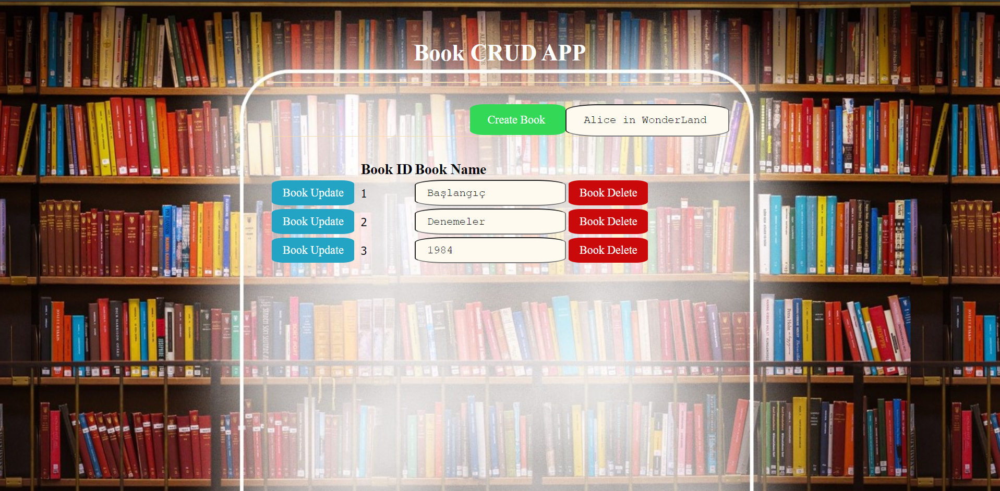

# Book CRUD App 

This is an application created for books with this application and can be applied create, read, update and delete options.Mongo DB was used as the database. 

### Create
The book whose name is entered is added to the database by using the Create Book button. A new and unique id is assigned to it.

### Read
We can see and read the books in the database with the books listed down and their id.

### Update
If we want to change the name of a book, we can edit the books we want to change and use the update book button next to it.

### Delete
With the delete button next to the sorted books, the selected book will be automatically deleted from the database and will not be displayed.

# Simple One Page Web Interface

