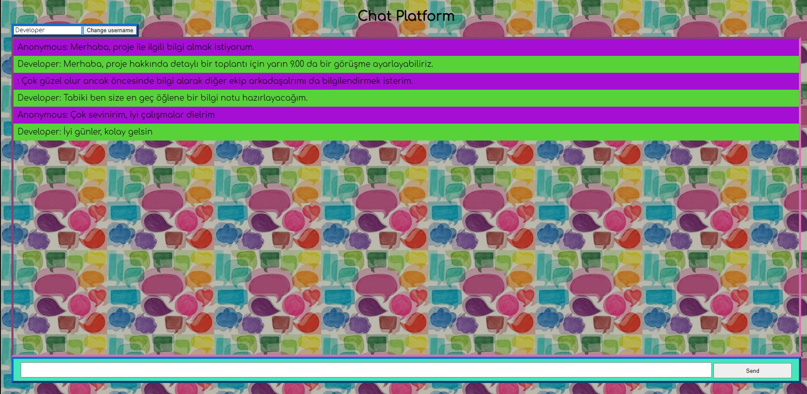

# ChatApp_Simple

This chat application simply provides a chat environment where 2 or more users can talk to each other by changing names.

### Users
Users can start talking on the system with "change username" at the beginning. Otherwise, the system names it anonymously.

### Send message
The user activates the system by typing the input and pressing the enter key.

# ChatPlatform
### Example1 Dialogue

### Example2 Dialogue

