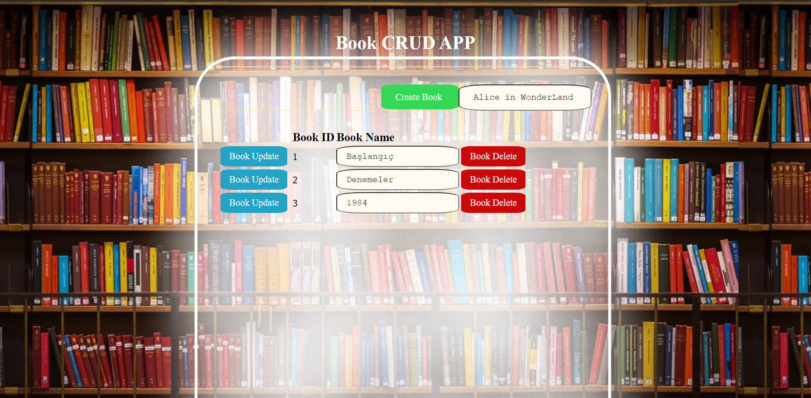
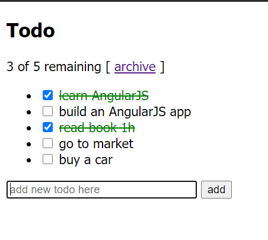
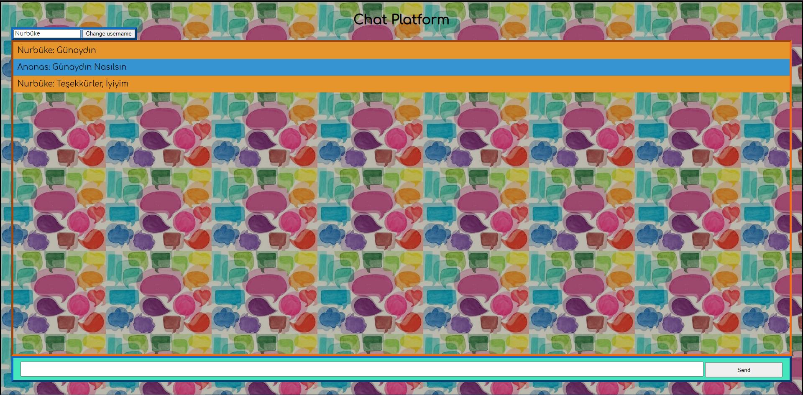
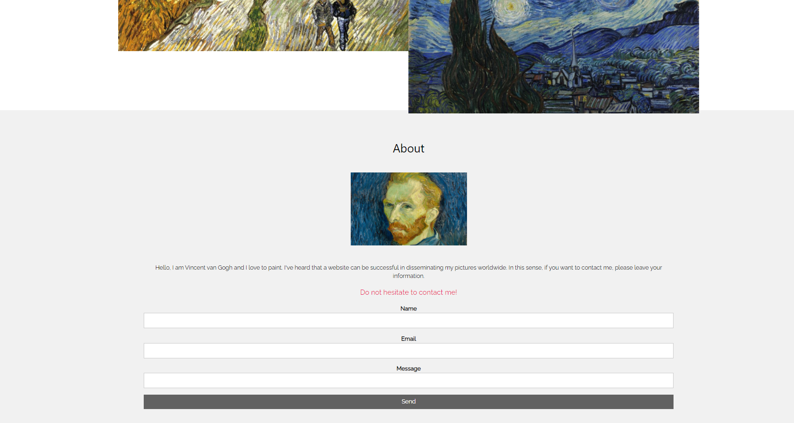

# Datateam_Staj2020
This repo contains works done during the Datateam internship 2020.

# BOOK CRUD APP

>This is an application created for books with this application and can be applied create, read, update and delete options.Mongo DB was used as the database. 

# TODO APP
> It is a simple todo application. New activities that can be done are entertainment, and those that have been done are deleted with the checkbox.

# Talk_with_Buzz

>This application includes potential sentence matches and the flow of dialogue as if there was a bot opposite.
Chatbot has been identified with Buzz-Lightyear and added interface and conversations.

# ChatApp_Simple
> This chat application simply provides a chat environment where 2 or more users can talk to each other by changing names.

# Vincent van Gogh
This repo was developed for vincent van gogh and includes his illustrations. Includes form sections for communication.

