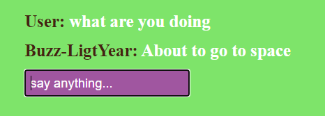
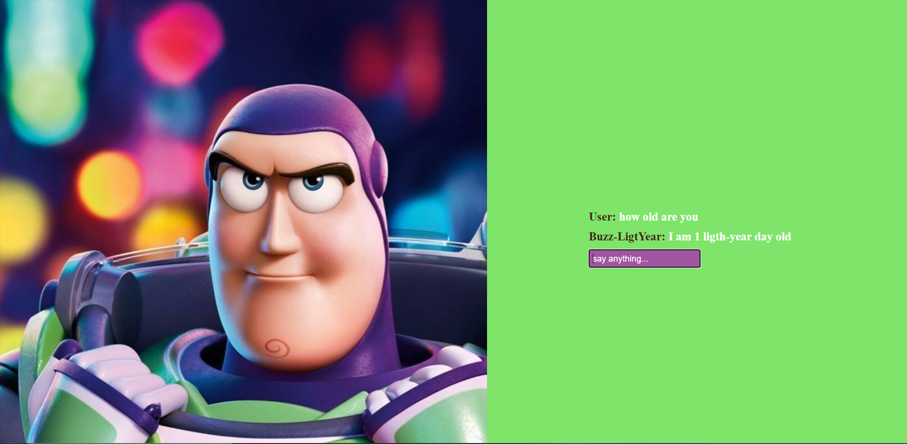

# Talk with Buzz

This application includes potential sentence matches and the flow of dialogue as if there was a bot opposite.
Chatbot has been identified with Buzz-Lightyear and added interface and conversations.

### User & Buzz
"User" contains inputs from the user, and "Buzz" contains answers from the bot.

### Send message
The user activates the system by typing the input and pressing the enter key.

# Dialog Interface
### Example1 Dialogue

### Example1 Dialogue

